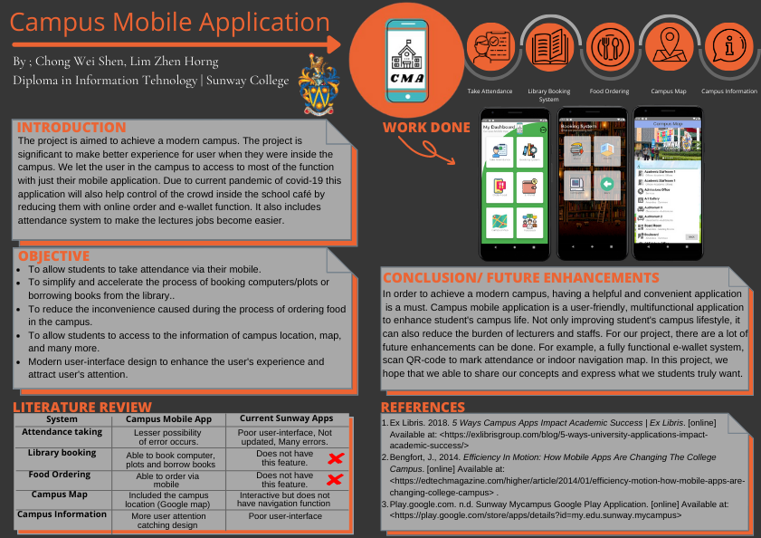

# CollegeApp
## Diploma in IT, Final Year Project - Campus Mobile Application
Application by Chong Wei Shen AKA LaggingNinja

Contacts \
Discord: 阿轩~ Wei Shen#8528 \
LinkedIn: Chong Wei Shen \
Email: cws331600@gmail.com 

###### Project Poster: 


In order for the DATABASE to work, following action need to be done:\
1.Copy the CA_database file and put into ur xampp/htdocs\
2.Create a database in mysql : ca_database\
3.Insert the sql code in CreateTable_SQL.txt , to create tables.\
4. Next, you will need to copy your IPv4 from cmd and put it into the java files that needed\
 - First, go to CMD type: ipconfig
 - Copy Ipv4 Address
 - Paste into "YOUR_IP_HERE" to all the files needed, example bellow\
Example(this is from line63 of Login.java): ```PutData putData = new PutData("http://YOUR_IP_HERE/CA_database/login.php", "POST", field, data);```\
Files that need to modify^ : Login.java, Feedback.java, SignUp.java,attendance.java, attendance_History.java, booking_books.java, booking_computers.java, booking_rooms.java.\
Follow this video if don't understand:https://youtu.be/X8oD4q3XtQQ?t=2296 <br/>
5. Done and all set to run the app!


//bellow are android studio <-> Github tutorials <br/>
Android studio GitHub tutorial(first time) : https://www.youtube.com/watch?v=k04Sca3Cpmo <br/>
How to Commit,Push: https://youtu.be/6dwcMlK6s4w?t=1211 <br/>
How to pull /update :https://youtu.be/6dwcMlK6s4w?t=1474
